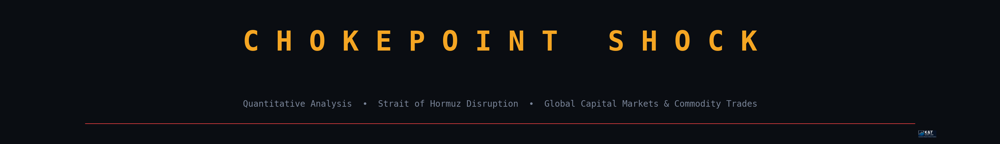

# 🛢️ Chokepoint Shock
### Quantitative Analysis of Strait of Hormuz Disruption on Global Capital Markets & Commodity Trades

<p align="center">
  
</p>

> **K&T Quant Labs** — Research Series | Version 2.1 | 2026

---

## 📌 Overview

This project delivers a full quantitative framework for analyzing how a potential **Strait of Hormuz disruption** propagates through global capital markets — from crude oil futures to equities, safe havens, currencies, and volatility regimes.

The Strait of Hormuz is the world's most critical oil chokepoint, handling ~20% of global oil supply. A disruption would trigger cascading shocks across energy, macro, and financial markets. This toolkit quantifies *how much*, *how fast*, and *which assets* are most exposed.

---

## 📊 Charts & Analysis Produced

| # | Output | Description |
|---|--------|-------------|
| 00 | `00_title_banner.png` | Research header |
| 01 | `01_normalized_cross_asset_performance.png` | Multi-asset normalized performance (Base=100) |
| 02 | `02_brent_wti_spread_and_vol.png` | Brent–WTI spread + realized volatility (20/60-day) |
| 03 | `03_brent_spy_rolling_correlation.png` | 60-day rolling correlation: Brent vs S&P 500 |
| 04 | `04_event_window_performance.png` | Event window ±10 days around shock date |
| 05 | `05_brent_market_regimes.png` | 3-state GMM regime detection (Calm / Stress / Disruption) |
| 06 | `06_cross_asset_correlation_heatmap.png` | 9-asset return correlation matrix |
| 07 | `07_risk_metrics_table.png` | VaR 95%, CVaR 95%, Sharpe, Max Drawdown |
| 08 | `08_stress_scenario_response.png` | Cross-asset median response on Brent >+3% days |
| 09 | `09_vix_vs_brent.png` | VIX vs Brent dual-axis (Fear vs Oil Premium) |

---

## 🏗️ Project Structure

```
chokepoint-shock/
│
├── chokepoint_shock.py          # Main analysis script
├── requirements.txt             # Python dependencies
├── .gitignore
│
├── outputs/                     # Generated charts & CSVs (auto-created)
│   ├── *.png                    # 10 publication-quality charts
│   └── *.csv                    # market_prices, returns, features, regimes, risk_metrics
│
├── notebooks/
│   └── chokepoint_analysis.ipynb  # Jupyter notebook version
│
└── data/                        # Optional: cached local data
```

---

## ⚙️ Methodology

### Assets Tracked
| Asset | Ticker | Role |
|-------|--------|------|
| Brent Crude | `BZ=F` | Primary shock proxy |
| WTI Crude | `CL=F` | US crude benchmark |
| Natural Gas | `NG=F` | Energy complex |
| Energy Equities | `XLE` | Sector response |
| Airlines | `JETS` | Transport cost victim |
| US Dollar | `UUP` | Safe haven / petrodollar |
| Gold | `GLD` | Risk-off haven |
| S&P 500 | `SPY` | Broad market |
| Long Treasuries | `TLT` | Rate / flight-to-safety |
| VIX | `^VIX` | Fear gauge |

### Analytics Pipeline
1. **Data** — Live market data via `yfinance` from 2024-01-01
2. **Feature Engineering** — Returns, 20/60-day realized vol, RSI-14, rolling correlations
3. **Regime Detection** — 3-state Gaussian Mixture Model on (return, volatility) space
4. **Event Study** — ±10 trading day window around user-defined shock date
5. **Risk Metrics** — VaR 95%, CVaR 95%, Annualized Sharpe, Max Drawdown per asset
6. **Stress Scenario** — Conditional cross-asset response on Brent >+3% shock days

---

## 🚀 Quick Start

### 1. Clone the repository
```bash
git clone https://github.com/YOUR_USERNAME/chokepoint-shock.git
cd chokepoint-shock
```

### 2. Install dependencies
```bash
pip install -r requirements.txt
```

### 3. Configure settings
Edit the **User Settings** section in `chokepoint_shock.py`:
```python
LOGO_PATH  = r"path/to/your/logo.png"   # Optional — leave blank to skip
START_DATE = "2024-01-01"               # Analysis start date
EVENT_DATE = "2026-03-15"               # Your shock/event date
OUTPUT_DIR = r"path/to/save/outputs"    # Where charts are saved
```

### 4. Run
```bash
python chokepoint_shock.py
```

All 10 charts + 5 CSVs will be saved to `OUTPUT_DIR`.

---

## 📦 Requirements

```
yfinance>=0.2.36
pandas>=2.0
numpy>=1.24
matplotlib>=3.7
scikit-learn>=1.3
scipy>=1.11
```

---

## 📈 Key Findings (Sample — 2024–2026 Data)

- **Brent–WTI spread** spiked to **$13+/bbl** around the March 2026 shock window — signaling acute Hormuz premium pricing
- **NatGas** showed the highest annualized volatility at **~88%** — most sensitive to supply disruption fears
- **Gold** delivered the best risk-adjusted return (Sharpe **1.77**), confirming safe-haven rotation
- **Airlines** were the hardest-hit equity sub-sector on high Brent shock days (median **–0.98%**)
- **TLT** (long bonds) showed negative correlation to crude (–0.20), acting as a portfolio hedge
- The GMM regime detector flagged **Disruption** regime entry in early 2026 as Brent surged past $110

---

## 🎨 Visual Style

Dark geopolitical theme built in pure `matplotlib`:
- Near-black background (`#0A0D12`) with amber crude, crisis red, teal safe-haven palette
- Figure-level logo placement (no overlap with data)
- Watermarked with K&T Quant Labs branding
- 200 DPI output, publication-ready

---

## 📄 License

MIT License — free to use, adapt, and extend with attribution.

---

## 👤 Author

**K&T Quant Labs**  
*Quantitative Research & Market Analytics*

---

*Data sourced from Yahoo Finance via yfinance. This is for research and educational purposes only. Not financial advice.*
